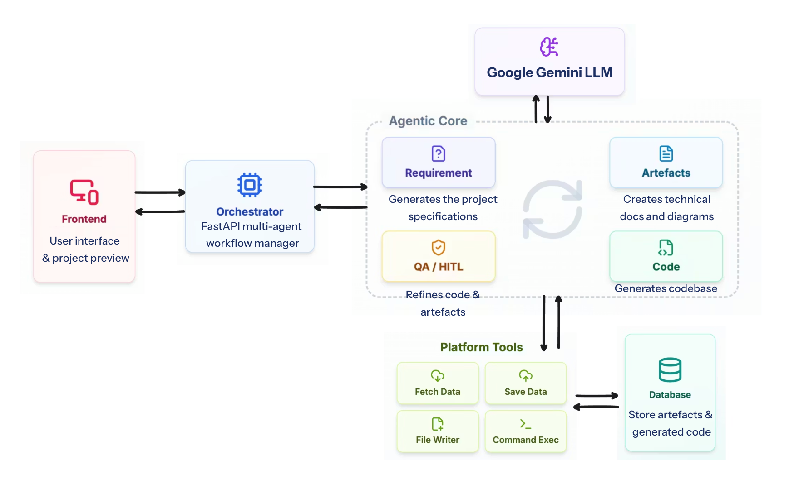

# 🎯 ProtoPilot

**Turning Product Vision into Working Prototypes**

An intelligent prototyping platform that uses LLM agents to transform product requirements into fully functional Angular applications. Simply describe your product idea, and ProtoPilot generates a complete specification, design artifacts, and working code—with an interactive chat interface for iterative refinement.

> **UCI MCS 2026 Capstone Project** | **Sponsored by [Cotality](https://cotality.com)**

---

## 📋 Project Overview

**ProtoPilot** bridges the gap between product vision and working prototypes. Instead of lengthy specification documents and manual development cycles, PMs and non-technical stakeholders can:

1. Answer guided questions about their product
2. Receive AI-generated specifications (PRD, user flows, design docs)
3. Refine specs through conversational chat
4. Preview a live, interactive prototype
5. Download all artifacts (code, designs, documentation)

**Target Users:**
- **Product Managers** — Define and iterate on product vision rapidly
- **Non-Technical Stakeholders** — Communicate requirements without technical jargon
- **Startup Founders** — Validate product concepts with working prototypes
- **Design Teams** — Generate initial design systems and documentation

---

## 👥 Team

| Name | LinkedIn |
|------|----------|
| Omkar Dabir | [LinkedIn URL] |
| Xin Xiang | [LinkedIn URL] |
| Yiniu Han | [LinkedIn URL] |
| Zhihao Wang | [LinkedIn URL] |

---

## ✨ Features

✅ **Guided Requirements Gathering** — Interactive Q&A wizard to collect product details, features, and design preferences

✅ **Smart Suggestions** — Choose from AI-generated suggestions or define custom requirements

✅ **User Dashboard** — Manage multiple projects, view project status, access previous work

✅ **Specification Documents** — Auto-generated PRD, user flow diagrams, design docs, technical specs rendered as Markdown

✅ **Iterative Chat Interface** — Refine specifications through natural conversation with AI

✅ **Live Prototype Preview** — View and interact with generated Angular application in real-time

✅ **Code Editor View** — Browse generated source code with syntax highlighting and make temporary modifications

✅ **Code Refinement Chat** — Use chat to request code changes and improvements

✅ **Export All Artifacts** — Download complete code files, design files, and documentation

---

## 🏗️ Architecture

ProtoPilot uses a multi-agent orchestration system to generate production-ready prototypes:



**Key Components:**

- **Frontend (Angular 21)**: Handles user dashboard, requirements wizard, spec review with chat, live prototype preview, and code editor
- **FastAPI Backend**: REST API for project management, authentication, and agent orchestration
- **Orchestrator**: Coordinates multi-agent workflow, manages conversation state and project data
- **4 Specialized Agents**: 
  - **Requirements Agent** — Analyzes user input and generates detailed PRD
  - **Code Generation Agent** — Creates Angular components and services
  - **QA Agent** — Validates specifications and identifies gaps
  - **Artifacts Agent** — Generates design docs, user flows, and export packages
- **LLM Integration**: Google Gemini & Claude models via Cotality's private LLM service
- **SQLite Database**: Stores projects, sessions, and user data
- **Tools & Functions**: Markdown rendering, diagram generation, code export utilities

---

## ⚙️ Setup Instructions

### Prerequisites
- Node.js 18+ (for frontend)
- Python 3.13.0 (for backend)
- npm or yarn (for frontend package management)

### Backend Setup

```bash
cd backend
python3 -m venv .venv
source .venv/bin/activate  # On Windows: .venv\Scripts\activate
pip install -r requirements.txt
cp .example.env .env
uvicorn api.server:app --reload --port 8000
```

**Important:** ProtoPilot uses Cotality's private LLM service, which requires OAuth credentials (CLIENT_ID and CLIENT_SECRET). Refer to the `.example.env` file and add your Cotality credentials to `.env`.

### Frontend Setup

```bash
cd frontend
npm install
npm start
```

Navigate to `http://localhost:4200/`. The application automatically reloads when you modify source files.

---

## 🚀 How to Run Locally

1. **Start the backend** (Terminal 1):
   ```bash
   cd backend
   source .venv/bin/activate
   uvicorn api.server:app --reload --port 8000
   ```

2. **Start the frontend** (Terminal 2):
   ```bash
   cd frontend
   npm start
   ```

3. **Open in browser**:
   ```
   http://localhost:4200
   ```

4. Create a new project through the **Requirements Wizard**, answer the guided questions, and watch ProtoPilot generate your specification and prototype in real-time.

---

## ✅ Testing & Verification

TBD

---

## 🌐 Deployment & CI/CD

**Current Status:** CI/CD is set up for this repo and gets triggered whenever new commits are pushed into the `chore/render_deployment` branch.

### Backend Deployment
- **Deployed on:** Google Cloud Run
- **Configuration:** Requires environment variables for LLM API credentials

### Frontend Deployment
- **Deployed on:** Render
- **URL:** https://protopilot.onrender.com/
- **Configuration:** Built with `npm run build` and served via Render's static hosting

---

## 🎬 Demo

Watch ProtoPilot transform a product idea into a working prototype:

📹 **Demo Video Link:** `[TBD]`

The demo shows the complete workflow: requirements gathering → specification preview → chat refinement → live prototype interaction → code download.

---

## 🔮 Known Issues & Future Work
Please refer our issues tracker here: \
https://github.com/orgs/Team-OXYZen/projects/1

### Known Issues / Improvements
- [ ] Authentication currently uses session-based tokens; OAuth2 integration planned
- [ ] Allow users to export the generated markdown files

### Future Enhancements
- [ ] **GitHub Integration** — Auto-create repository and push generated code
- [ ] **JIRA Integration** — Sync requirements and track development tasks
- [ ] **User Authentication** — Implement OAuth2 with multiple identity providers
- [ ] **Java Backend Support** — Generate Java/Spring Boot backends in addition to frontend
- [ ] **Advanced State Management** — NgRx/Akita integration for complex apps
- [ ] **Database Schema Generation** — Auto-generate database schemas from specifications
- [ ] **API Mock Server** — Generate mock REST API alongside frontend
- [ ] **Multi-framework Support** — Extend beyond Angular (React, Vue, Svelte)
- [ ] **Design System Export** — Export generated designs to Figma/Sketch

---

## 🧠 Available LLM Models via Cotality LiteLLM Proxy

The following models are available for your ProtoPilot agents:

```
gemini-2.0-flash-001-litellm-usc1
gemini-2.0-flash-001-litellm-usw1
gemini-2.0-flash-lite-001-litellm-usc1
gemini-2.0-flash-lite-001-litellm-usw1
gemini-2.5-flash-litellm-usc1
gemini-2.5-flash-litellm-usw1
gemini-2.5-flash-lite-litellm-usc1
gemini-2.5-flash-lite-litellm-usw1
gemini-2.5-pro-litellm-usc1
gemini-2.5-pro-litellm-usw1
claude-sonnet-4@20250514-litellm-use5
claude-sonnet-4-6-litellm-use5
imagen-3.0-generate-002-litellm-usc1
text-embedding-005-litellm-usc1
text-embedding-005-litellm-usw1
llama-4-maverick-17b-128e-instruct-maas-litellm-use5
```

---
