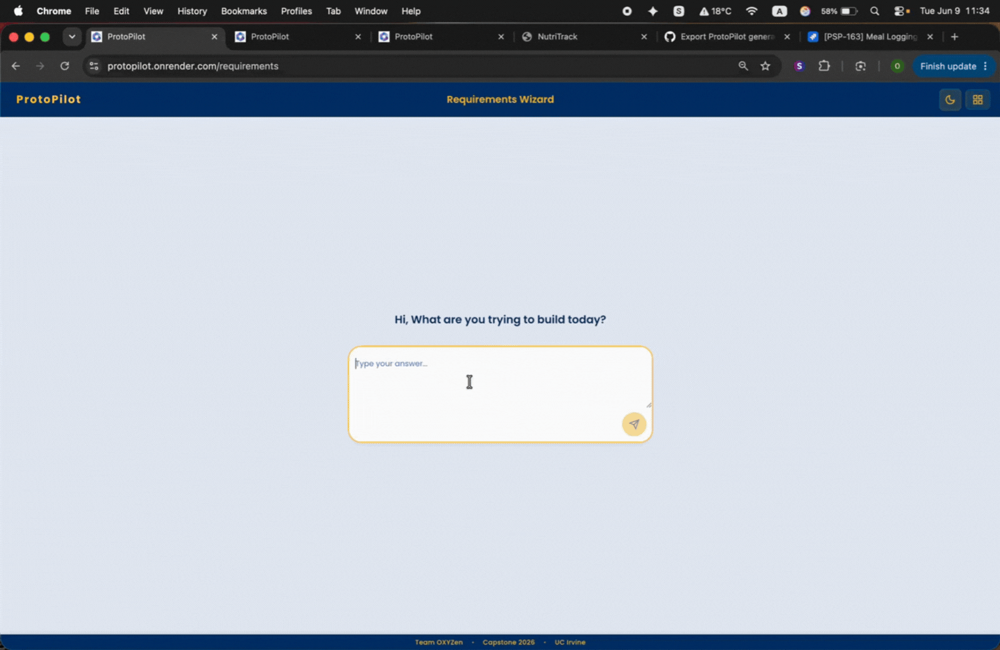
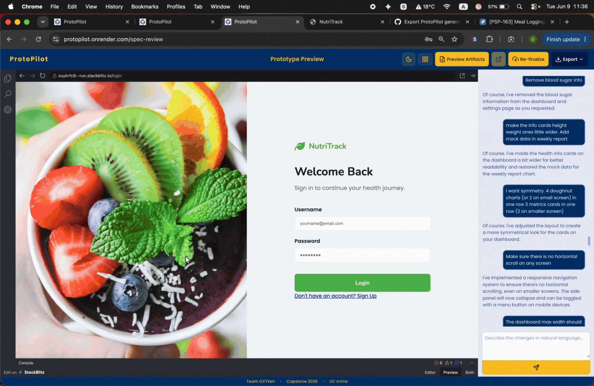
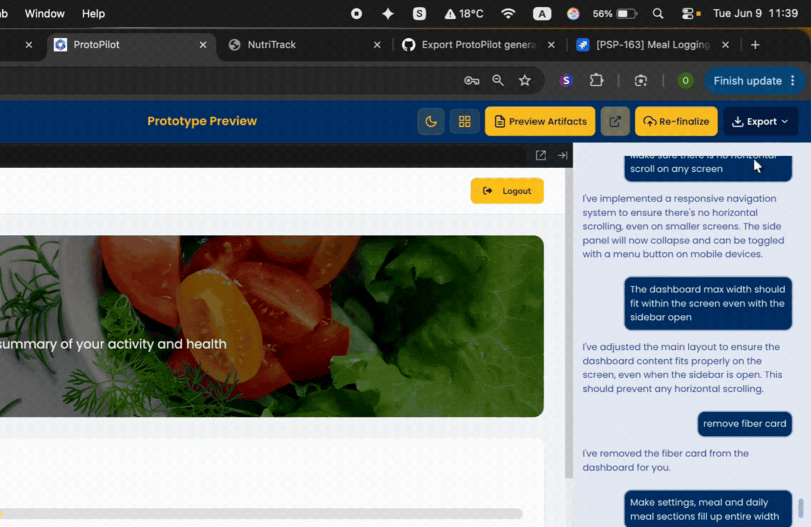
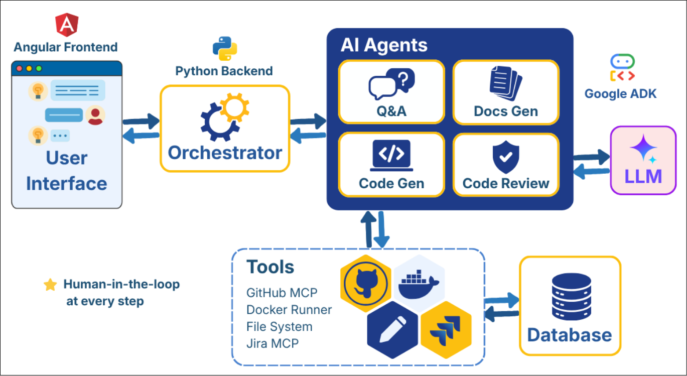

# 🎯 ProtoPilot

**Turning Product Vision into Working Prototypes**

An intelligent prototyping platform that uses AI agents to transform product requirements into fully functional Angular applications. Simply describe your product idea, and ProtoPilot generates a complete specification, design artifacts, and working code—with an interactive chat interface for iterative refinement.

> **UCI MCS 2026 Capstone Project** | **Sponsored by [Cotality](https://cotality.com)**

> **Try it now:** [Live App](https://protopilot.onrender.com/) | [Demo Video](https://drive.google.com/file/d/1YBcEzvtccvi5uLdjAVtt_jqFzcrAHjjQ/view?usp=sharing)

---

## 📋 Project Overview

**ProtoPilot** bridges the gap between product vision and working prototypes. Instead of lengthy specification documents and manual development cycles, PMs and non-technical stakeholders can:

1. Answer guided questions about their product
2. Receive AI-generated specifications (PRD, user flows, design docs)
3. Refine specs through conversational chat
4. Preview a live, interactive prototype
5. Download all artifacts (code, designs, documentation)

**Target Users:**
- **Product Managers** — Define and iterate on product vision rapidly
- **Non-Technical Stakeholders** — Communicate requirements without technical jargon
- **Startup Founders** — Validate product concepts with working prototypes
- **Design Teams** — Generate initial design systems and documentation

---

## ✨ Features

✅ **Guided Requirements Gathering** — Interactive Q&A wizard to collect product details, features, and design preferences

✅ **Smart Suggestions** — Choose from AI-generated suggestions or define custom requirements

✅ **User Dashboard** — Manage multiple projects, view project status, access previous work

✅ **Specification Documents** — Auto-generated PRD, user flow diagrams, design docs, technical specs rendered as Markdown

✅ **Iterative Chat Interface** — Refine specifications through natural conversation with AI

✅ **Live Prototype Preview** — View and interact with generated Angular application in real-time

✅ **Code Editor View** — Browse generated source code with syntax highlighting and make temporary modifications

✅ **Code Refinement Chat** — Use chat to request code changes and improvements

✅ **Export All Artifacts** — Download complete code files, design files, and documentation

✅ **Live Deploy** — One-click Docker Compose deployment of generated Angular + Java Spring Boot stack with a live preview URL

✅ **Third-Party Integrations** — Export generated code to GitHub, create Jira agile backlogs, and publish artifacts to Confluence

---

## 🎬 Demo

Watch ProtoPilot transform a product idea into a working prototype:

📹 **Demo Video Link:** https://drive.google.com/file/d/1YBcEzvtccvi5uLdjAVtt_jqFzcrAHjjQ/view?usp=sharing

The demo shows the complete workflow: requirements gathering → specification preview → chat refinement → live prototype interaction → code download.

---

## 📸 User FLow at a Glance

Here are a few key moments in the ProtoPilot workflow:

<div align="center">
  <table>
    <tr>
      <td align="center">
      <strong>Requirements Gathering</strong>
      <br />
      
      <br />
      <em>An initial idea for a calories tracker app was entered, and clarifying questions were then asked.</em>
      </td>
   </tr>
   <tr>
      <td align="center">
      <strong>Generated Artifacts</strong>
      <br />
      
      <br />
      <em>Design docs were then generated.</em>
      </td>
   </tr>
    <tr>
      <td align="center">
      <strong>Live Prototype Preview</strong>
      <br />
      
      <br />
      <em>Once approved, the code was written and an interactive prototype was presented, which could then be modified through the chat interface.</em>
      </td>
    </tr>
    <tr>
      <td align="center" colspan="2">
      <strong>Integrations</strong>
      <br />
      
      <br />
      <em>The generated code and docs could be downloaded, code could be exported to GitHub, docs to Confluence, and Jira stories could be created automatically.</em>
      </td>
    </tr>
  </table>
</div>

---

## ⚙️ Setup Instructions

### Prerequisites
- Node.js 18+ (for frontend)
- Python 3.13.0 (for backend)
- npm or yarn (for frontend package management)

### Backend Setup

```bash
cd backend
python3 -m venv .venv
source .venv/bin/activate  # On Windows: .venv\Scripts\activate
pip install -r requirements.txt
cp .env.example .env
uvicorn api.server:app --reload --port 8000
```

**Important:** ProtoPilot uses Cotality's private LLM service, which requires OAuth credentials (`CLIENT_ID` and `CLIENT_SECRET`). Refer to `backend/.env.example` and add your Cotality credentials to `backend/.env`.

GitHub, Jira, and Confluence integrations can be configured per user from **Dashboard → Preferences → Connection Settings**. The required OAuth app credentials, destination keys, callback URLs, and granular GitHub/Atlassian permissions are documented in [`docs/integrations.md`](docs/integrations.md).

### Frontend Setup

```bash
cd frontend
npm install
npm start
```

The frontend API base URL is configured in `frontend/src/environments/environment.ts` through `apiBaseUrl`.

Navigate to `http://localhost:4200/`. The application automatically reloads when you modify source files.

---

## 🚀 How to Run Locally

1. **Start the backend** (Terminal 1):
   ```bash
   cd backend
   source .venv/bin/activate
   uvicorn api.server:app --reload --port 8000
   ```

2. **Start the frontend** (Terminal 2):
   ```bash
   cd frontend
   npm start
   ```

3. **Open in browser**:
   ```
   http://localhost:4200
   ```

4. Create a new project through the **Requirements Wizard**, answer the guided questions, and watch ProtoPilot generate your specification and prototype in real-time.

---

## 🏗️ Architecture

ProtoPilot uses a multi-agent orchestration system to generate production-ready prototypes:



**Key Components:**

- **Frontend (Angular 21)**: Handles user dashboard, requirements wizard, spec review with chat, live prototype preview, and code editor
- **FastAPI Backend**: REST API for project management, authentication, and agent orchestration
- **Orchestrator**: Coordinates multi-agent workflow, manages conversation state and project data
- **4 Specialized Agents**: 
  - **Requirements Agent** — Analyzes user input and generates detailed PRD
  - **Code Generation Agent** — Creates Angular components and services
  - **QA Agent** — Validates specifications and identifies gaps
  - **Artifacts Agent** — Generates design docs, user flows, and export packages
- **LLM Integration**: Google Gemini & Claude models via Cotality's private LLM service
- **SQLite Database**: Stores projects, sessions, and user data
- **Tools & Functions**: Markdown rendering, diagram generation, code export utilities

---

## 🌐 Deployment & CI/CD

**Current Status:** CI/CD is set up for this repo and gets triggered whenever new commits are pushed into the `chore/render_deployment` branch.

### Backend Deployment
- **Deployed on:** Google Cloud VM
- **Configuration:** Requires environment variables for LLM API credentials

### Frontend Deployment
- **Deployed on:** Render
- **URL:** https://protopilot.onrender.com/
- **Configuration:** Built with `npm run build` and served via Render's static hosting

---

## 👥 Team

| Name | LinkedIn |
|------|----------|
| Omkar Dabir | https://www.linkedin.com/in/rakmo33/ |
| Xin Jiang | https://www.linkedin.com/in/xin-jiang12/ |
| Yiniu Han | https://www.linkedin.com/in/yiniu-han-0a323638b/ |
| Zhihao Wang | https://www.linkedin.com/in/zhihao-wang-83a154378/ |

---

## 🔮 Known Issues & Future Work
Please refer our issues tracker here: \
https://github.com/orgs/Team-OXYZen/projects/1

### Future Enhancements
- [ ] **Multi-framework Support** — Extend beyond Angular (React, Vue, Svelte)
- [ ] **Design System Export** — Export generated designs to Figma/Sketch
- [ ] **Custom LLM Keys Support** — Allow users to plug their own LLM keys

---